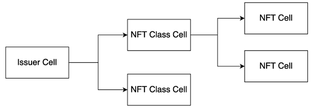

# WIP: [Multi-purpose NFT (mNFT)](https://talk.nervos.org/t/rfc-multi-purpose-nft-draft-spec/5434) Tutorial

This tutorial will guide you through the process of creating a multi-purpose NFT (mNFT). 

## What is mNFT?
As of 2023-05, mNFT is the simplest NFT protocal on [CKB](https://github.com/nervosnetwork/ckb).
- [RFC: Multi-purpose NFT Draft Spec](https://talk.nervos.org/t/rfc-multi-purpose-nft-draft-spec/5434)
- The [mNFT CKB Scripts](https://github.com/nervina-labs/ckb-nft-scripts) implementation
- Deployments
  - [Testnet](https://github.com/nervina-labs/ckb-nft-scripts/wiki/Aggron-Testnet-deployment)
  - [Mainnet](https://github.com/nervina-labs/ckb-nft-scripts/wiki/Lina-Mainnet-deployment)

## Prerequisites

Before you begin, you should have the following installed:

- Node.js

## Story
Alice, an artist, wants to issue an NFT collection on CKB for her artworks.

Bob, a developer in the Nervos network community.

Alice asks Bob for help, to guild her through the steps to create the NFTs on CKB.

Bob is happy to help Alice with the programming work.

Once the NFT collection is set up, Alice will transfer some NFTs to Bob as gifts.


## Steps


### Step 1. Create an Issuer Cell for Alice

Bob begins by creating an issuer cell for Alice, which will store the issuer's metadata:
```js
// TODO: write the info of issuer into the Issuer Cell
{
  name: "issuer’s name in UTF-8 encoding"
  website: "issuer’s website URL"
  email: "email address"
  authentication: "typically an SNS announcement about the issuance"
  image: "image URL for issuer"
}
```

The first step in creating an mNFT is to create an issuer cell.
This can be done by running the following command:

```bash
npm run issuer:create

# Resulte
# https://pudge.explorer.nervos.org/transaction/0x639ff420f1e38621a83a5fa625b6f5cbbadc798592f1a417dc43a2da81755038
```

#### TODO: check the issuer info on chain


### Step 2. Create the first Class Cell

The next step is to create a class cell. 
Every NFT Class Cell stands for a group of specific NFT items with the same properties.
And different NFT Cells issued by the same NFT Class Cell will be marked with different TokenID as its identity.

To create a Class cell, Alice will need to provide some information about her first NFT:
```js
{
  name: "the NFT class name"
  description: "introduction of this NFT class"
  renderer: "NFT image data in base64 format, see also https://www.w3docs.com/tools/image-base64"
  total: "the issurance number limitation, zero for unlimited"
}
```
The `IssuerID` combined with the class cell will ensure that only Alice can create NFTs for this NFT class.


This can be done by running the following command:
```
npm run class:create
```

### Step 3. Create some NFT Cells

The final step is to create an NFT cell. This can be done using the ckb-nft-toolkit by running the following command:

```
npm run nft:create
```

### Step 4. Transfer some NFTs from Alice to Bob

As a token of appreciation, Alice will create a transaction that transfers ownership of some random NFTs to Bob's address.
Bob will then be able to see the NFTs in his wallet and do whatever he likes with them, such as sell them on a marketplace or keep them as a collectible.

### show the code
...TBD...

TODO: show to transfer records on CKB explorer
e.g. https://explorer.nervos.org/nft-info/0x3264d31d25959e6a3811fe59847f078376b0fcd6ba4c37a169cf973a2b3f552c/17


## Conclusion

In this tutorial, you learned how to create some multi-purpose NFTs. You can now use this knowledge to create your own mNFTs and explore the possibilities on Nervos CKB blockchain.

## Concepts
...


## Credits

This tutorial is based on [ckb-nft-toolkit](https://github.com/duanyytop/ckb-nft-toolkit), a toolkit that provides methods to create, transfer, update, and destroy issuer cells, class cells, and NFT cells of mNFT protocal on Nervos CKB.
Thanks to @duanyytop for developing the ckb-nft-toolkit.

## References
- [The mNFT on-chain scripts](https://github.com/nervina-labs/ckb-nft-scripts)
